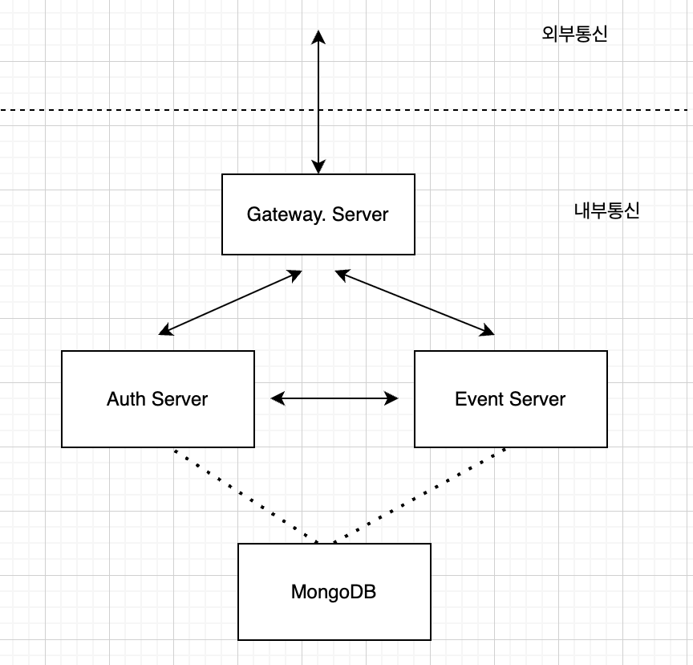
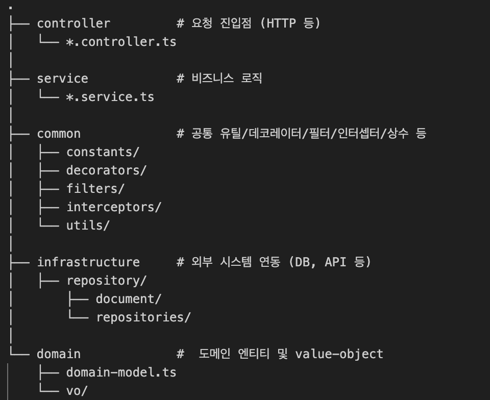
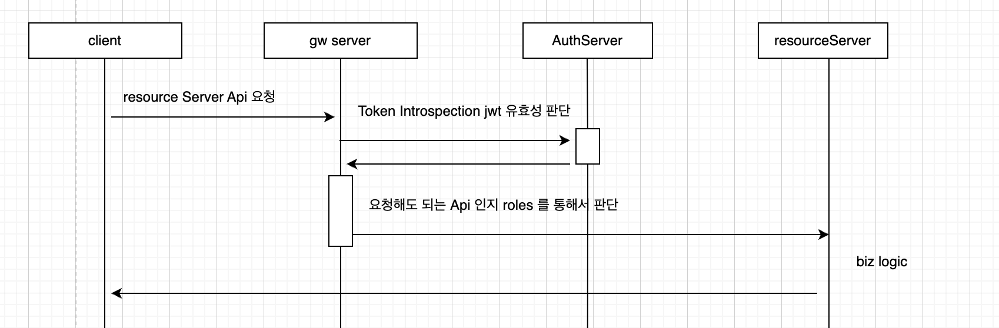

# EVENT 서버 관련 과제

# 🧩 Event Server

NestJS 기반 이벤트 처리 서버입니다. AUTH, EVENT , GATEWAY 로 연결되어 있고 간략한 구조는 아래와 같습니다.

---

## 🛠️ 실행 방법 (Docker Compose)

### 1. 프로젝트 클론 및 이동 후 docker-compose 실행

```bash
docker compose build
docker compose up -d
```

## 🛠️ 내부통신 API 명세 (swagger)

### 1. auth-server

```
http://localhost:8080/swagger
```

### 2. event-server

```
http://locahost:8081/swagger
```

## 🛠️ 통신 구조



## 🛠️ 코드 아키텍처



## 🛠️ 구현 사항

### auth-server

1. 유저 정보 조회 (내부용) API
2. 일반유저 회원가입 API
3. Admin `(ADMIN, AUDITOR, OPERATOR)` 회원가입
4. 로그인 API
5. token Introspection (token 이 유효한지에 대한) API
6. access Token refresh API (별도 refreshToken에 대한 guard 는 생성 x)

#### 고려사항

- auth server의 책임은 유저의 정보 그리고 jwt에 대한 발급이 있다고 생각하기 때문에 , 별도로 API gateway 에서 token 에 대한 유효성을 검증하는것이 아닌 Auth-server 를 통해서 검증하도록 `token-introspection` endpoint를 추가해두었습니다

### event-server

1. 이벤트생성 API
2. 이벤트 목록 조회 API
3. 이벤트 개별 조회 API
4. 보상 생성 API
5. 보상 목록 조회 API
6. 보상 요청 API
7. 보상 요청 목록 조회 API
8. 유저 개인별 요청 목록 조회 API
9. 보상 개별 조회 API

#### 고려사항

- mongoDB 의 장점을 살리기 위해서 데이터구조를 embeded 하게 넣는 구조를 사용하였습니다. 따라서 관계형 db 처럼 엔티티를 분리하는것이 아닌 event 및 requestReward 내에서 reward 및 event 값이 embed 형태로 들어가 있습니다
- 별도의 log interceptor를 통해서 보상요청에 대한 요청 및 결과를 비동기로 저장하게끔 해두었고 <요청, 결과> 에 대한 tracing이 되도록 `traceId` 를 넣어두었습니다,
- 별도의 snapshot schema는 만들지않았지만 보상요청시에는 무조건 그 당시 시점에 존재하는 reward 와 event 정보를 넣어두었습니다. 이유는 혹시라도 event나 보상이 바뀌기 전이였으면 해당내용에 대한 유저 cs 를 대응하기 위합입니다.
- eventList 조회는 조회가 많을 것 으로 예상되는 API 이기 때문에 cursor 기반 pagination 을 적용해 두었습니다.
- 중복 요청에 대한 부분은 race condition 이 발생되어 저장 될 수 있는 부분이라 `(userId , eventId)` 에 대한 unique constraint를 처리하여 중복 요청 될 수 없도록 처리를 해두었습니다.

### gw-server

1. proxySevice로 내부 서버에 bypass 하도록 개별API 설정
2. RoleGuard, 및 CustomAuthGuard 설정 및 API 의 Role 별 접근권한 설정.

#### 특이사항

- 위에서 말한것과 같이 jwt에 대한 유효성 검사는 auth-server(발급한 인증/인가 서버) 에 책임이 있다고 생각하여 `AuthGuard('jwt')` 를 쓰는 대신에 `customAuthGuard` 를 사용하여 `auth-server` 의 `token-introspection` 을 통해서 결과 값을 받고 인증 여부를 판별하도록 해두었습니다.

- 인가가 필요한경우에 대한 flow
  
